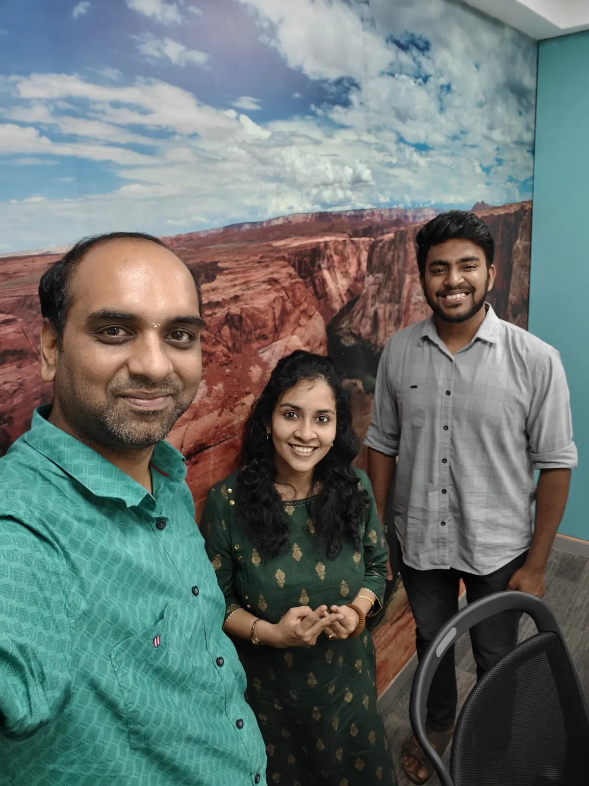
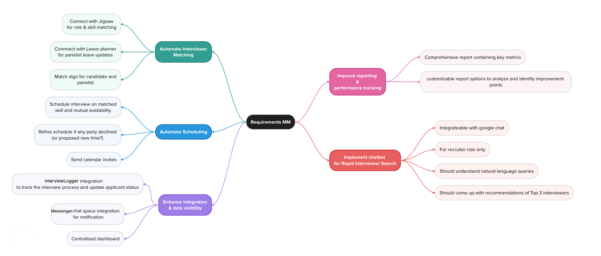
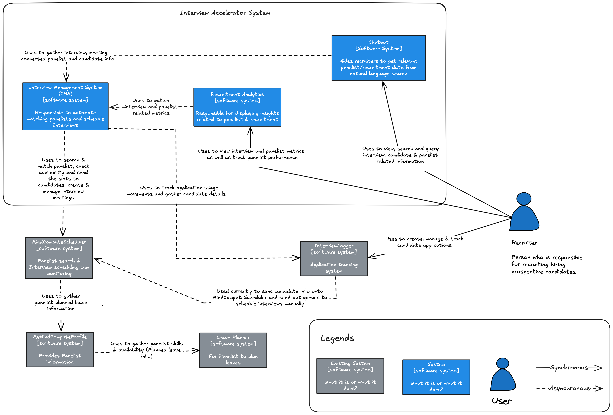
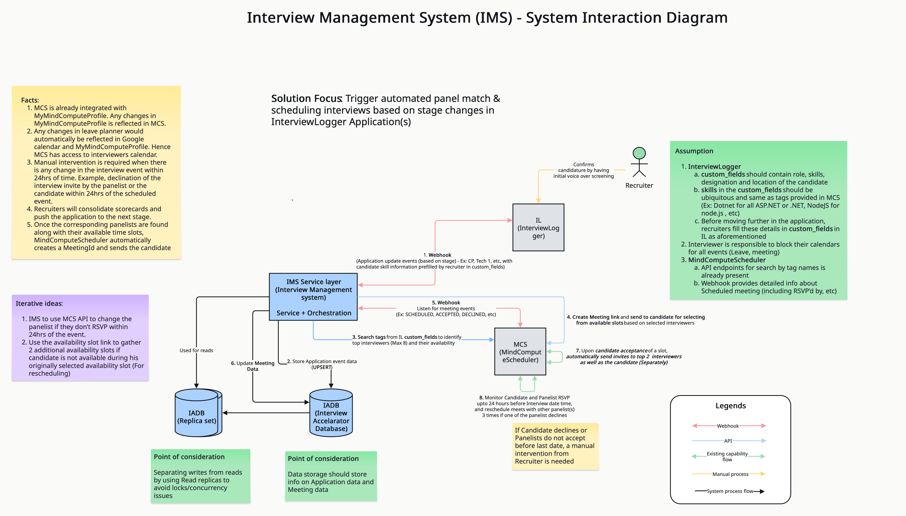
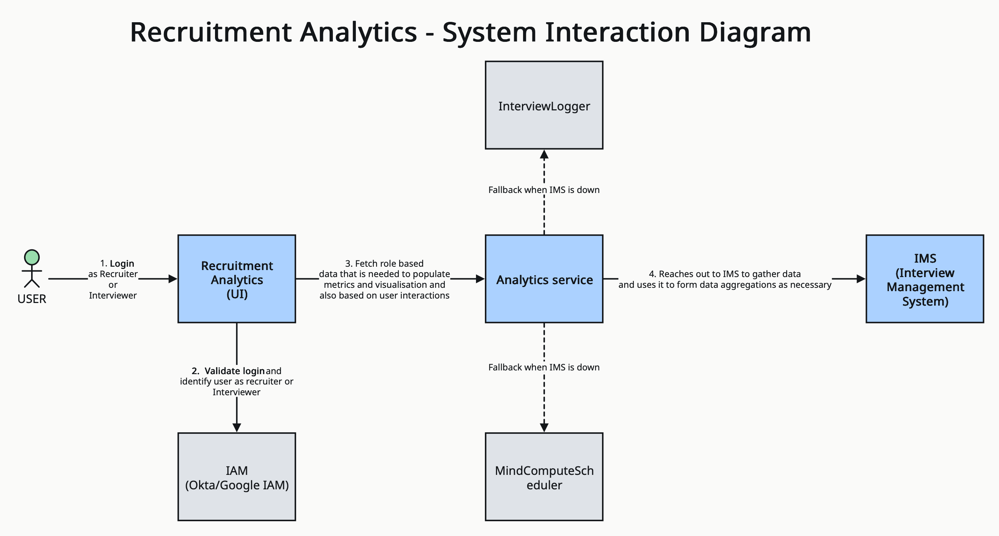
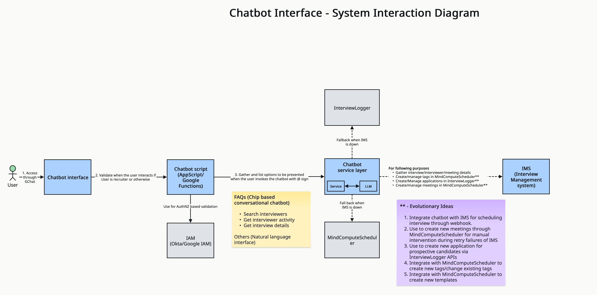
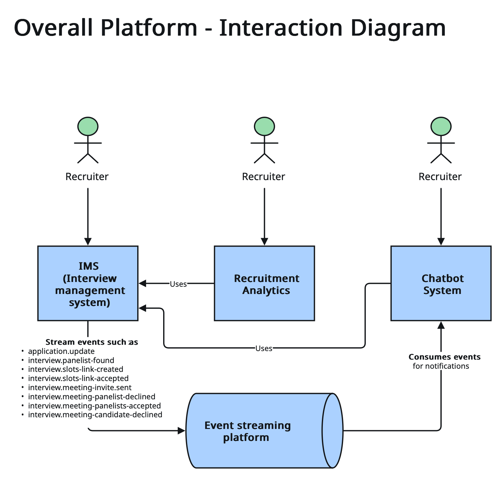
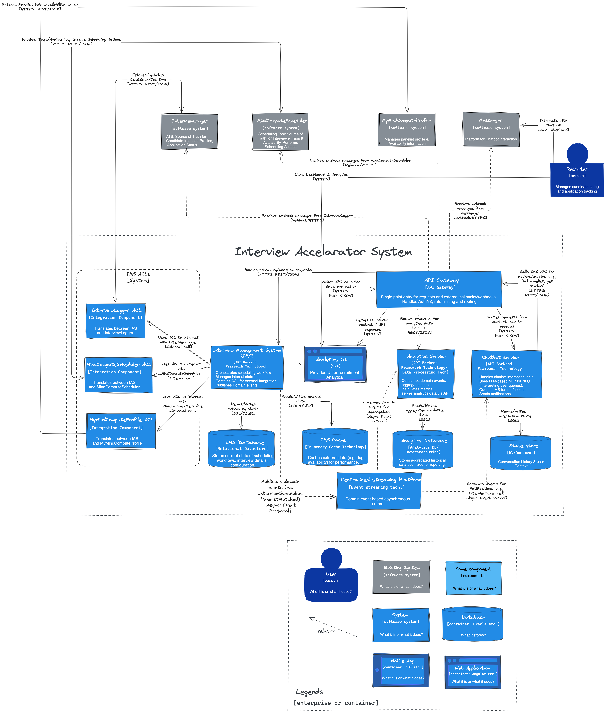

# Interview accelarator - Architectural Kata - Q1'2025

This is an honest attempt as Sketch squad to come up with Architectural Kata problem - Q1'2025

## Contents

- [Interview accelarator - Architectural Kata - Q1'2025](#interview-accelarator---architectural-kata---q12025)
  - [Contents](#contents)
  - [Team](#team)
  - [Introduction](#introduction)
    - [Existing system integration](#existing-system-integration)
    - [Existing process](#existing-process)
  - [Identifying potential COTs](#identifying-potential-cots)
  - [Event storming - An attempt to undertstand domain events](#event-storming---an-attempt-to-undertstand-domain-events)
  - [Identifying the architecture characteristics](#identifying-the-architecture-characteristics)
    - [Rationale behind the driving characteristics:](#rationale-behind-the-driving-characteristics)
      - [1. Performance](#1-performance)
      - [2. Extensibility](#2-extensibility)
      - [3. Maintainability](#3-maintainability)
  - [Choosing the architecture](#choosing-the-architecture)
  - [Understanding the system context](#understanding-the-system-context)
    - [Context Diagram (C1)](#context-diagram-c1)
      - [InterviewLogger](#interviewlogger)
      - [MindComputeScheduler](#mindcomputescheduler)
      - [MyMindComputeProfile](#mymindcomputeprofile)
      - [Interview management system (IMS)](#interview-management-system-ims)
      - [Recruitement analytics](#recruitement-analytics)
      - [Chatbot system](#chatbot-system)
    - [System interactions](#system-interactions)
      - [Interview management system](#interview-management-system)
      - [Recruitement Analytics](#recruitement-analytics-1)
      - [Chatbot system](#chatbot-system-1)
      - [Overall platform interaction](#overall-platform-interaction)
  - [Container diagram (C2)](#container-diagram-c2)
  - [Data Strategy Characteristics and Choices](#data-strategy-characteristics-and-choices)
  - [Observability Characteristics and Choices](#observability-characteristics-and-choices)
  - [Security Characteristics and Choices](#security-characteristics-and-choices)
  - [Hosting Characteristics and Choices](#hosting-characteristics-and-choices)
  - [Deployment Characteristics and Choices](#deployment-characteristics-and-choices)
  - [Evolutionary Ideas](#evolutionary-ideas)
  - [Usage of AI Tools](#usage-of-ai-tools)

## Team

Our team, the sketch squad consists of a versatile skilled individuals:

- [Namdhev Ganeshan]
- [Sushmaa R R]
- [Venkatash Kaliappan]

## Introduction

In today's world, Recruiters in MindCompute struggle to manage candidate application, finding appropriate panelist and scheduling interviews, since there is a lot of manual effort involved and there is no centralized system or platform to address these needs. Given the same, the Kata gives us an opportunity to give a better system to the recruitment team to not only seamlessly manage the panelist matching and interview scheduling, but also to provide a centralized analytics to visualize the metrics and derive useful insights. On top of this, the Kata excercise brings in a chatbot that could be leveraged by Recruiters to derive necessary information (Searching panelists, get interview data/metrics, Panelist metrics, etc.) through the use of natural language query/chat.

Below is our attempt to understand and represent the requirements from the original [Arch. Kata proposal](https://docs.google.com/document/d/1sk0MvKNpTAgF8WEBsNvex3cmX592EwLFGfmMZZjunyM/edit?usp=sharing):

While we initially thought about solution approaches and how to reach there, we were thinking if a monolithic or traditional layered architecture should be sufficient, upon connecting with TalOps and Recruiters, we have refined our [Requirements](Requirements/Requirements.md) and [Scope](Requirements/Scope.md) to understand the system and the requirements better. The more closer we look, we thought it would be better if we followed Domain driven design through Event storming to analyse and modularize the requirements for better solutioning. We have created the [ADR-01](ADR/ADR-01-Use%20Domain%20Driven%20Design.md) to record this decision and come up with DDD to formally solutionize the requirements

Following are our observations of current hiring flow based on our discussions with Recruiters and TalOps:

### Existing system integration

### Existing process

## Identifying potential COTs

After getting a clarfied set of requirements and understanding the pain points of recruiters, we attempted to check available COTs that could replace both InterviewLogger and MindComputeScheduler as a single unit. However, the more we understand from the features provided by existing systems and the learning curve involved for recruiters to get on a new system, we have decided to go with extending the existing systems. We have documented this decision in [ADR-02](ADR/ADR-02-Analyzing%20COTS%20for%20ATS.md)

## Event storming - An attempt to undertstand domain events

To understand the high level components that participate in fulfilling a specific domain requirement, we attempted to draw out the actors, systems, domain events and aggregations. We have taken it a bit further to understand the sequence of interactions between the aggregations in a bounded context and have covered it in our iterations. All these, could be found in the [Event storming file](EventStorming/event-storming.md).

## Identifying the architecture characteristics

Choosing the right architectural characteristics is a crucial step in designing an effective system that aligns with business needs and technical constraints. These characteristics directly influence how the system integrates with external platforms, manages data flow, and ensures optimal performance. By carefully evaluating these factors, we can define the most suitable software and infrastructure components that will drive flexibility, maintainability, and security while ensuring a seamless interview scheduling experience.

Given our system's requirements—such as integration with InterviewLogger, MindComputeScheduler, and MyMindComputeProfile, real-time event processing, and automated recruiter assistance—we have identified the following top three architectural characteristics as the foundation of our solution [ADR-03](ADR/ADR-03-Selecting%20Core%20Architectural%20Characteristics.md)

### Rationale behind the driving characteristics:

#### 1. Performance

- The system must be highly **responsive** to ensure a **smooth scheduling experience** for recruiters and interviewers.
- **Low-latency responses** are critical for real-time availability checks and conflict resolution.
- Optimizations such as **caching, database indexing, and asynchronous processing** will help maintain performance under heavy load

#### 2. Extensibility

- The system should be **adaptable** to support new **features, integrations, and scheduling rules** as hiring needs evolve.
- Future-proofing is important—new interview formats, additional **calendar providers (beyond MindComputeScheduler), AI-based interview matching, and custom workflows** should be easy to implement.

#### 3. Maintainability

- Since the system will undergo **continuous enhancements**, it should be **easy to debug, update, and modify**.
- **Clear separation of concerns**, modular design, and **well-documented APIs** will make maintenance easier for developers.

## Choosing the architecture

Having identified the top three driving characteristics, we can simply choose the architecture style that best fits our business case [ADR-04](ADR/ADR-04-Adopting%20a%20Three-System%20Architecture%20with%20EDA%20and%20Microservices.md).

## Understanding the system context

By following the [C4](https://c4model.com/) modelling, we attempted to understand the purpose of the systems and high level interactions between them. Following is the Context diagram that represents our Interview accelarator system.

### Context Diagram (C1)

From the above diagram and from the architecture chosen, we could understand that the below three systems play a major role in bringing the Interview Accelarator platform together:

- Interview management system
- Recruitment analytics
- Chatbot system

These systems interact with existing external entities such as MindComputeScheduler and InterviewLogger. The MindComputeScheduler is integrated closely with MyMindComputeProfile, which inturn is integrated with Leave planner.

#### InterviewLogger

Is the platform which acts as Applicant Tracking system (ATS) for recruiters to assess candidature of the applicant. This system provides the reecruiters to utilize the candidate resume, design stages based on role and designation to which candidate has applied, and queue the application for interviews.

#### MindComputeScheduler

Is the system in which TalOps take the queue further to identify matching panelists/interviewers via templates based on the candidate details. Once the interviewers are identified, they use MindComputeScheduler to create a link and send it to candidate for selecting available slots from the availability of matching panelists. Once the candidate selects an available slot, the MindComputeScheduler automatically schedules interview invites and sends the invitation separately to the candidate and the panelists identified earlier, based on the availability slot chosen.

MindComputeScheduler monitors the RSVP of candidate and the panelists automatically. If either of the panelist decline, it will attempt to reschedule to another panelist. This re-attempt happens thrice before sending notification to the recruiters and the talops for their manual intervention. Also, the re-tries happen only when the declines happen 24 hours before the scheduled interview time.

#### MyMindComputeProfile

MyMindComputeProfile holds the panelist details, including skills and leave history. The leave history is synced with the leave planner app such that any new plans in leave planner is immediately reflected in MyMindComputeProfile.

The skill information from MyMindComputeProfile is mapped against specific tags in MindComputeScheduler for finding the right panelist for a given candidate screening process.

#### Interview management system (IMS)

This system is responsible to manage interview capabilities by coordinating with InterviewLogger and MindComputeScheduler to understand the candidate background, find matching panelists, schedule and monitor interview invites.

#### Recruitement analytics

This is an analytics platform that could be used by the recruiters to gather insights on the current interview progress, past interviews and panelist performance metrics, amongst other interview/candidate related metrics/visualizations. The system can also generate on-demand reports. This utilizes IMS to gather all relevant details to aggregate and present the appropriate metrics data/visualization.

The recruitment analytics can also be used by Panelists to visualize their interview activity and related metrics.

#### Chatbot system

Chatbot system is responsible to provide on-demand panelist/interviewer and interview data to the recruiters. The chatbot is capable of understanding natural language queries to provide related data. It also utilizes IMS to gather relevant data.

### System interactions

Diving further to understand how these systems interact to provide better clarity and closer to solutioning the components, we have created the below interaction diagrams.

#### Interview management system

#### Recruitement Analytics

#### Chatbot system

#### Overall platform interaction

## Container diagram (C2)

## Data Strategy Characteristics and Choices

| Data Strategy Feature                     | System(s) Applicable                       | Rationale                                                                                                                             | Linked Characteristic(s)                                |
| ----------------------------------------- | ------------------------------------------ | ------------------------------------------------------------------------------------------------------------------------------------- | ------------------------------------------------------- |
| DDD Alignment / BC Data Ownership         | All (IMS, Analytics, Chatbot)              | Provides clear boundaries & domain encapsulation.                                                                                     | Maintainability, Extensibility                          |
| External Systems as SoT / Use of ACLs     | IMS (primary interaction), Chatbot (reads) | Leverages existing COTS ([ADR-02](/ADR/ADR-02-Analyzing%20COTS%20for%20ATS.md)); isolates internal domain via Anti-Corruption Layers. | Maintainability, Extensibility, Resilience              |
| Event-Driven Data Flow (via Event Stream) | All (IMS pub, Analytics/Chatbot sub)       | Decouples services; enables asynchronous processing & downstream consumers (EDA).                                                     | Performance, Maintainability, Extensibility             |
| Data Segregation per Microservice         | All (IMS, Analytics, Chatbot)              | Enables service autonomy, independent scaling & evolution.                                                                            | Maintainability, Extensibility, Performance, Resilience |
| Eventual Consistency (Default)            | Cross-Service Interactions                 | Optimizes availability & performance in distributed systems (common in EDA).                                                          | Performance                                             |
| Polyglot Persistence                      | All (System-level choice)                  | Selects storage type best suited to each service's specific data needs.                                                               | Performance, Maintainability                            |
| IMS: Relational DB (State)                | IMS                                        | Ensures transactional consistency (ACID) for core workflow state.                                                                     | Reliability, Maintainability                            |
| IMS: Event Log/Outbox (Events)            | IMS                                        | Guarantees reliable event publishing for EDA; provides auditability.                                                                  | Maintainability, Extensibility                          |
| IMS: Cache                                | IMS                                        | Reduces latency for frequent external/internal data access; reduces load.                                                             | Performance, Resilience                                 |
| Analytics: Analytical DB/DW               | Analytics                                  | Optimized storage & query engine for complex reporting & aggregation.                                                                 | Performance, Extensibility                              |
| Chatbot: KV/Document DB                   | Chatbot                                    | Provides fast read/write access for session/conversation state; flexible schema.                                                      | Performance, Extensibility                              |
| Saga Pattern (for Consistency)            | Critical Cross-Service Workflows           | Manages distributed transactions requiring higher consistency; handles compensations.                                                 | Reliability, Maintainability                            |
| Data Quality/Governance Practices         | All                                        | Ensures data integrity via validation, monitoring, documentation; aids troubleshooting.                                               | Maintainability                                         |
| Data Security/Privacy Practices           | All                                        | Protects sensitive PII through access controls, encryption; ensures compliance.                                                       | Security                                                |

## Observability Characteristics and Choices

| Observability Feature | System(s) Applicable | Rationale                                                                                                                                                                                                                        | Linked Characteristic(s)                 |
| --------------------- | -------------------- | -------------------------------------------------------------------------------------------------------------------------------------------------------------------------------------------------------------------------------- | ---------------------------------------- |
| Centralized Logging   | All                  | Aggregates logs from all distributed services and infrastructure into one place, crucial for troubleshooting complex issues and understanding system behavior across components.                                                 | Maintainability                          |
| Metrics Monitoring    | All                  | Provides quantitative insights into application performance (latency, error rates, throughput) and infrastructure health (CPU, memory). Enables performance tuning, capacity planning, and proactive issue detection via alerts. | Performance, Maintainability, Resilience |
| Distributed Tracing   | All                  | Allows tracking a single request's journey through multiple microservices and the event stream. Essential for pinpointing latency bottlenecks and understanding dependencies in complex, asynchronous flows.                     | Performance, Maintainability             |
| Alerting              | All                  | Configured based on logs and metrics to proactively notify operations teams about critical errors, performance degradation, or resource saturation, enabling faster response times.                                              | Performance, Maintainability, Resilience |

## Security Characteristics and Choices

| Security Feature                       | System(s) Applicable            | Rationale                                                                         | Linked Characteristic(s)  |
| -------------------------------------- | ------------------------------- | --------------------------------------------------------------------------------- | ------------------------- |
| Secure VPC / Network Segmentation      | All Infrastructure              | Isolate application network, control traffic flow using least privilege.          | Security                  |
| API Gateway (Security Aspects)         | API Entry Point                 | Centralize AuthN/AuthZ, rate limiting, input validation, protect backends.        | Security, Maintainability |
| Secrets Management Solution            | All Services & Infrastructure   | Securely store, manage, and rotate sensitive credentials.                         | Security, Maintainability |
| Network Policies / Firewalls           | All Communication Paths         | Enforce fine-grained network access control between services/external systems.    | Security                  |
| Identity & Access Management (IAM)     | Cloud Environment / Users       | Control access to cloud resources and potentially user application access (RBAC). | Security                  |
| Application-Level Security (Implied)   | All Services                    | Implement secure coding, input validation, dependency scanning, etc.              | Security, Maintainability |
| Data Encryption (At Rest & In Transit) | All Data Stores & Communication | Protect sensitive data confidentiality and integrity.                             | Security                  |
| Security Logging & Monitoring          | All                             | Detect/respond to security incidents; provide audit trails.                       | Security, Maintainability |

## Hosting Characteristics and Choices

| Hosting Feature       | System(s) Applicable | Rationale                                                              | Linked Characteristic(s)                    |
| --------------------- | -------------------- | ---------------------------------------------------------------------- | ------------------------------------------- |
| Public Cloud Platform | All                  | Leverage managed services, scalability, global reach, innovation pace. | Performance, Maintainability, Extensibility |
| Suitable Cloud Region | All                  | Initial deployment near primary users to minimize latency.             | Performance                                 |
| Multi-AZ Deployment   | All                  | High availability for critical components, reduces downtime impact.    | Resilience, Maintainability                 |

## Deployment Characteristics and Choices

| Security Feature                       | System(s) Applicable            | Rationale                                                                         | Linked Characteristic(s)  |
| -------------------------------------- | ------------------------------- | --------------------------------------------------------------------------------- | ------------------------- |
| Secure VPC / Network Segmentation      | All Infrastructure              | Isolate application network, control traffic flow using least privilege.          | Security                  |
| API Gateway (Security Aspects)         | API Entry Point                 | Centralize AuthN/AuthZ, rate limiting, input validation, protect backends.        | Security, Maintainability |
| Secrets Management Solution            | All Services & Infrastructure   | Securely store, manage, and rotate sensitive credentials.                         | Security, Maintainability |
| Network Policies / Firewalls           | All Communication Paths         | Enforce fine-grained network access control between services/external systems.    | Security                  |
| Identity & Access Management (IAM)     | Cloud Environment / Users       | Control access to cloud resources and potentially user application access (RBAC). | Security                  |
| Application-Level Security (Implied)   | All Services                    | Implement secure coding, input validation, dependency scanning, etc.              | Security, Maintainability |
| Data Encryption (At Rest & In Transit) | All Data Stores & Communication | Protect sensitive data confidentiality and integrity.                             | Security                  |
| Security Logging & Monitoring          | All                             | Detect/respond to security incidents; provide audit trails.                       | Security, Maintainability |

Okay, here's the table with the "Evolutionary Ideas" content, including statement headings I've come up with and rephrased descriptions where needed for clarity and conciseness:

## Evolutionary Ideas

| Statement                                             | Systems Involved                       | Description                                                                                                                                                                              |
| :---------------------------------------------------- | :------------------------------------- | :--------------------------------------------------------------------------------------------------------------------------------------------------------------------------------------- |
| **Intelligent MindComputeScheduler Tag Suggestion**               | InterviewLogger, IMS NLP, MindComputeScheduler          | Automatically parse resumes in InterviewLogger and send the data to IMS NLP to identify and suggest relevant skill tags based on MindComputeScheduler's existing tag vocabulary.                          |
| **Chatbot-Driven Tag Management**                     | Chatbot, MindComputeScheduler, IMS NLP, InterviewLogger | Enable recruiters to create, modify, and manage MindComputeScheduler tags through a conversational interface provided by the Chatbot.                                                                |
| **Automated Interviewer Rescheduling on No-RSVP**     | MindComputeScheduler, IMS                          | If an interviewer doesn't RSVP within 24 hours of a scheduled interview, IMS will use the MindComputeScheduler API to automatically trigger a rescheduling process or suggest alternative panelists. |
| **Proactive Candidate Rescheduling with Extra Slots** | MindComputeScheduler                               | While providing the available slot link to the candidate , include additional fields to capture alternate availability from the candidate.             |

## Usage of AI Tools

We have used ChatGPT (o3-mini,4o), Claude (Sonnet 3.7), Gemini Deep Research and Gemini Advanced 2.5 Pro (Experimental) to brainstorm ideas used in solution approaches, identifying architectural characteristics and solution validations.
